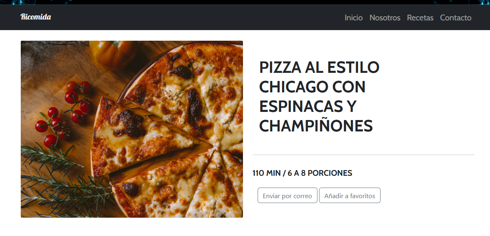
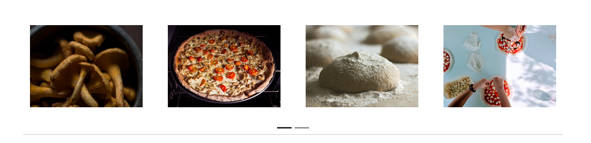
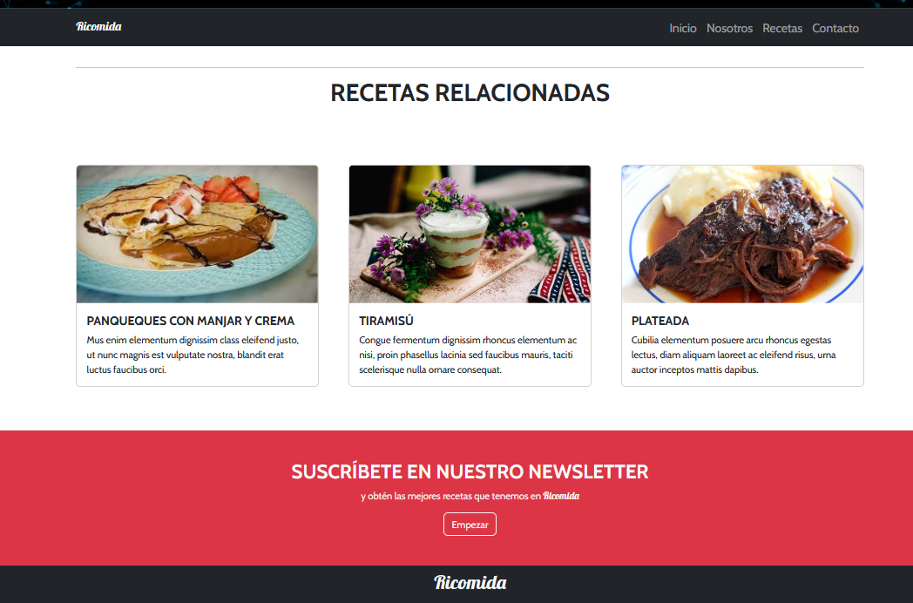

Desafío - Ricomida
-
● Para realizar este desafío debes haber estudiado previamente todo el material disponible en el LMS correspondiente a la unidad.

● Una vez terminado el desafío, comprime la carpeta que contiene el desarrollo de los
requerimientos solicitados y sube el .zip en el LMS.

● Puntaje total: 10 puntos.

● Desarrollo desafío:
        
        ○ El desafío se debe desarrollar en parejas.
        ○ Para la realización del desafío necesitarás apoyarte del archivo Apoyo Desafío

- Ricomida.
    
    Habilidades a evaluar

        ● Implementar adecuadamente la librería jQuery en un proyecto web, utilizando recursos locales y externos.
        
        ● Implementar componentes JavaScript de Bootstrap, para agregar elementos visuales a un sitio web.

Descripción
-
El siguiente desafío permitirá al estudiante practicar las habilidades adquiridas hasta el momento en relación con HTML, CSS, Bootstrap y jQuery. 
Por consiguiente, este desafío consiste en la construcción de una página web relacionada con la preparación de comidas y
muestra de recetas, donde todo el sitio debe estar  construido con características responsivas, partiendo de una maqueta con su guía de estilos, en donde tendrán que desarrollar desde cero el esqueleto de la página web (HTML), luego se deberá ir agregando los estilos indicados para mejorar la apariencia (CSS). 

Seguidamente, se agregarán elementos y componentes de  Bootstrap para mejorar aún más el estilo y permitir que el sitio se adapte a cualquier dispositivo (tablet, móvil, entre otros), incluyendo componentes especiales de Bootstrap que requieren la incorporación de jQuery, como el caso de los
Tooltips. 

Finalmente, la página web tendrá tres interacciones que se activan mediante eventos provocados por el usuario, como lo son los eventos de “click” y “dblclick”, métodos como “toggle” y “on” y selectores de id, etiquetas y clases, permitiendo la ejecución de ventanas emergentes, el cambio de estilos de textos y la aparición y desaparición de elementos mediante animaciones.

Requerimientos

En grupos de dos personas se debe resolver los siguientes requerimientos:

1. Carousel: Utilizar el carousel de Bootstrap con 2    carousel ítems y cada uno con 4 imágenes en su interior. 
Éste en tamaños sm, xs debe desaparecer.
(1 Punto)

2. Tooltip: Incluir un botón "Enviar por correo" con un tooltip aplicado. 
(1 Punto)

3. Evento: Utilizar el evento “click” de jquery para mostrar una alerta al hacer un clic sobre el botón de "Enviar por Correo" mediante el uso de los selectores por Id, implementar el id a la etiqueta del botón con nombre: "enviarCorreo". 
El mensaje a mostrar en la alerta deberá ser: "El correo fue enviado correctamente...". 
(2 Puntos)

4. Selectores de etiqueta: Utilizando los selectores de etiqueta y el método de jQuery
`on` con el evento `dblclick`, solamente modificar el color del texto de los títulos
"INGREDIENTES" y "PREPARACIÓN" a color rojo cuando se haga doble clic sobre
cada uno de ellos por individual. (3 Puntos)
5. Selectores de clase: Implementar los selectores de clases, utilizar el método de
jQuery denominado `toggle` para hacer desaparecer y aparecer el contenido en todas
las tarjetas "card" de la sección de Recetas Relacionadas, esto debe suceder cuando
el usuario haga un clic sobre el título de cualquiera de las tres tarjetas. (3 Puntos)

Hint: Guíate por la siguiente maqueta.

Guía de Estilos Tipografías:

        ● Cabin
        ● Lobster

Google Fonts Weight:

        ● Cabin Regular (400)
        ● Cabin Bold (700)
        ● Lobster Regular (400)

Colores 
        
        ● #373a3c
        ● #dddddd
        ● #000 o var(--black)
        ● #fff o var(--white)
        ● #dc3545 o var(--danger)

Imagenes del Proyecto Realizado:

